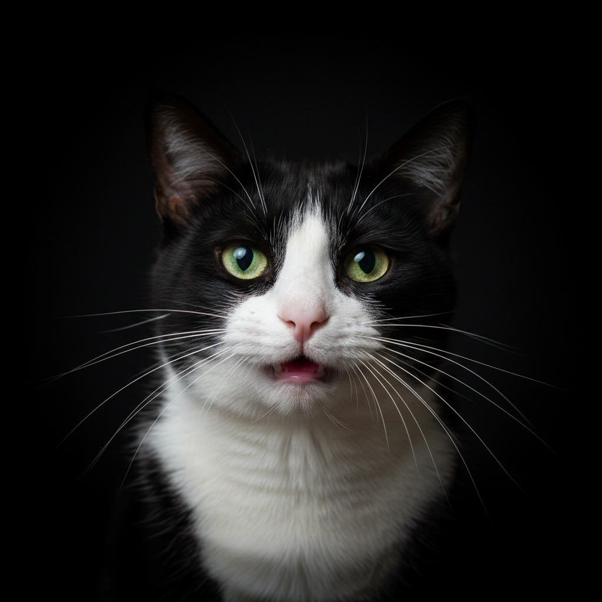
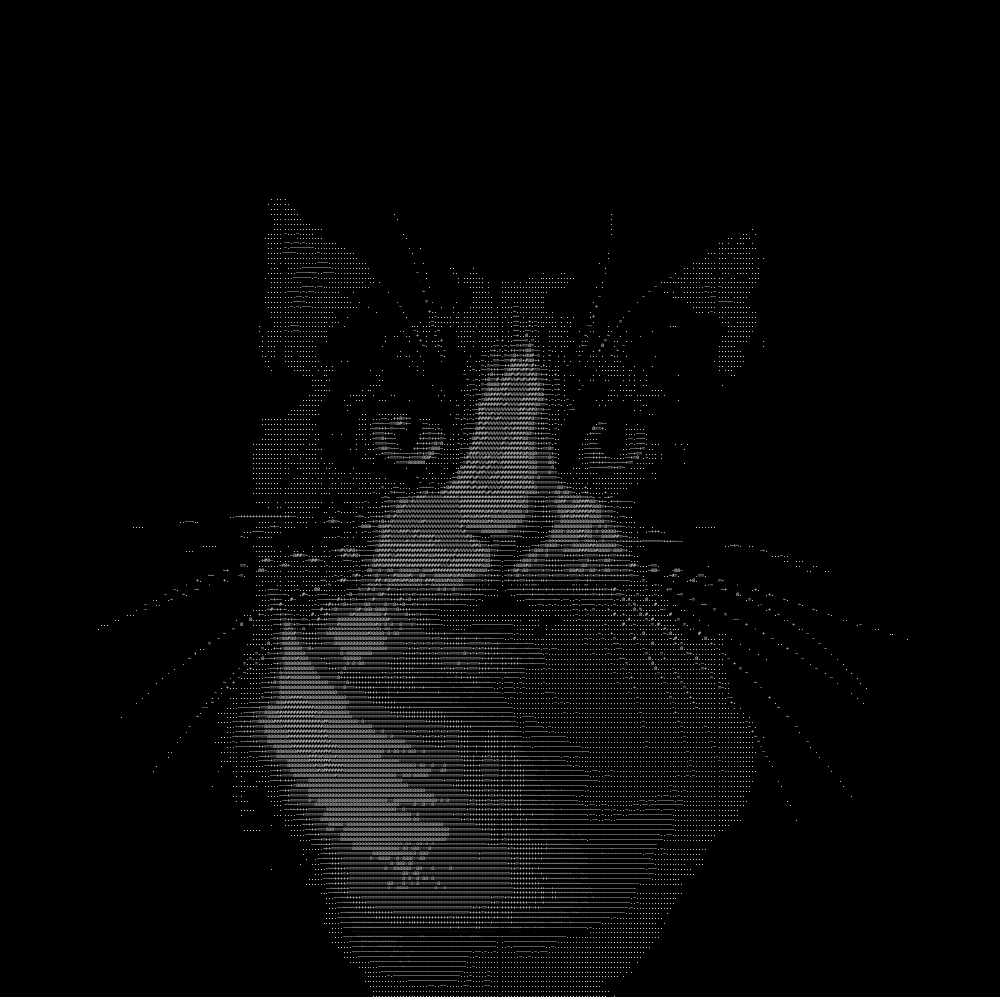
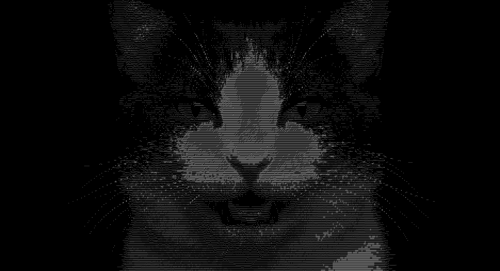

# ASCII Video Converter

Convert videos to ASCII art videos.

## Installation

Install the required dependencies:

```bash
pip install -r requirements.txt
```

Or install manually:

```bash
pip install opencv-python pillow==9.5.0 moviepy==1.0.3 tqdm numpy
```

**Note:** This tool requires `ffmpeg` (specifically `ffprobe`) to be installed on your system for reading video rotation metadata. Install it via:
- macOS: `brew install ffmpeg`
- Linux: `sudo apt install ffmpeg` (Debian/Ubuntu) or `sudo yum install ffmpeg` (RHEL/CentOS)
- Windows: Download from [ffmpeg.org](https://ffmpeg.org/download.html)

## Usage

```bash
python ascii_video.py <input_video> [options]
```

### Options

- `-o, --output`: Path to output video file (default: input filename with `_ascii` suffix, e.g., `input.mp4` → `input_ascii.mp4`)
- `-f, --fontsize`: Font size - lower values = higher resolution but slower processing (default: 10)
- `-s, --scale`: Output scale factor - 1.0 = original size (default: 1.0)

### Examples

```bash
# Basic conversion (outputs to input_ascii.mp4)
python ascii_video.py input.mp4

# Custom output filename
python ascii_video.py input.mp4 -o my_ascii_video.mp4

# Higher resolution (smaller font)
python ascii_video.py input.mp4 -f 8

# Scale down the input video
python ascii_video.py input.mp4 -s 0.5
```

### Example Output

Side-by-side comparison video (original vs ASCII):

[demo/cat_src_collage.mp4](demo/cat_src_collage.mp4)

Demo video: https://youtu.be/fYmgNLIDjYE

## ASCII Image Converter

Convert single images to ASCII art images.

### Usage

```bash
python ascii_image.py <input_image> [options]
```

### Options

- `-o, --output`: Path to output image file (default: input filename with `_ascii` suffix, e.g., `input.jpg` → `input_ascii.jpg`)
- `-f, --fontsize`: Font size - lower values = higher resolution but slower processing (default: 10)
- `-s, --scale`: Output scale factor - 1.0 = original size (default: 1.0)

### Examples

```bash
# Basic conversion (outputs to input_ascii.jpg)
python ascii_image.py input.jpg

# Custom output filename
python ascii_image.py input.jpg -o my_ascii_image.png

# Higher resolution (smaller font)
python ascii_image.py input.jpg -f 8

# Scale down the input image
python ascii_image.py input.jpg -s 0.5
```

### Example Output

Example images created with `-f 5`:

**Original → ASCII Art:**

 → 

 → 
