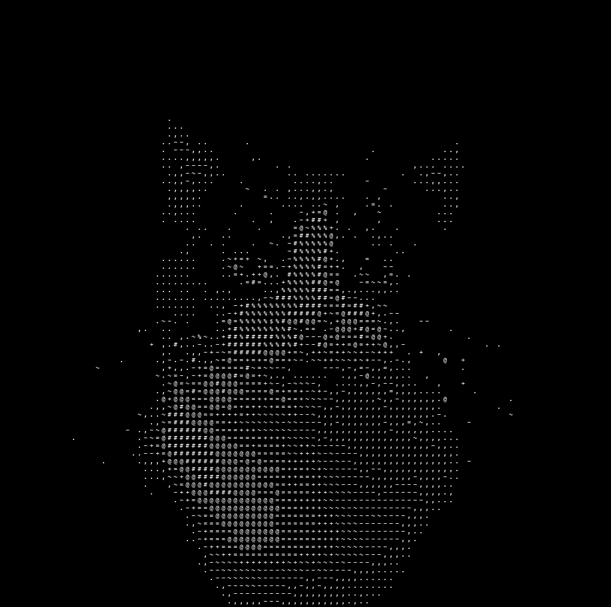

# ASCII & Emoji Video Converter

Convert images and videos to ASCII art or emoji art.

Tested on macOS only. Font loading should be updated for other systems.

## Installation

Install the required dependencies:

```bash
pip install -r requirements.txt
```

Or install manually:

```bash
pip install opencv-python pillow==9.5.0 moviepy==1.0.3 tqdm numpy
```

**Note:** This tool requires `ffmpeg` (specifically `ffprobe`) to be installed on your system for reading video rotation metadata. Install it via:

`brew install ffmpeg`

## Usage

```bash
python ascii_video.py <input_video> [options]
```

### Options

- `-o, --output`: Path to output video file (default: input filename with `_ascii` suffix, e.g., `input.mp4` → `input_ascii.mp4`)
- `-f, --fontsize`: Font size - lower values = higher resolution but slower processing (default: 10)
- `-s, --scale`: Output scale factor - 1.0 = original size (default: 1.0)
- `--bg-color`: Background color - accepts color names (e.g., "black", "white") or hex codes (e.g., "#000000") (default: "black")
- `--fg-color`: Foreground color - accepts color names (e.g., "white", "black") or hex codes (e.g., "#FFFFFF") (default: "white")
- `--invert-brightness`: Invert brightness mapping - bright areas become dark characters, dark areas become bright characters
- `--blocks`: Use ASCII block characters (█ ▓ ▒ ░ space) instead of regular characters
- `--preserve-colors`: Preserve original colors from the image/video - ignores fg-color, disables grayscale conversion and brightness normalization
- `--tint`: Tint color to apply when `--preserve-colors` is set - accepts color names or hex codes (e.g., "red", "#FF6600")

### Examples

```bash
# Basic conversion (outputs to input_ascii.mp4)
python ascii_video.py input.mp4

# Custom output filename
python ascii_video.py input.mp4 -o my_ascii_video.mp4

# Higher resolution (smaller font)
python ascii_video.py input.mp4 -f 8

# Scale down the input video
python ascii_video.py input.mp4 -s 0.5

# Custom colors (inverted: white background, black text)
python ascii_video.py input.mp4 --bg-color white --fg-color black

# Custom colors using hex codes
python ascii_video.py input.mp4 --bg-color "#0000FF" --fg-color "#FFFF00"

# Invert brightness mapping
python ascii_video.py input.mp4 --invert-brightness

# Use ASCII block characters
python ascii_video.py input.mp4 --blocks

# Preserve original colors
python ascii_video.py input.mp4 --preserve-colors

# Preserve colors with a tint
python ascii_video.py input.mp4 --preserve-colors --tint red
python ascii_video.py input.mp4 --preserve-colors --tint "#FF6600"
```

### Example Output

Side-by-side comparison video (original vs ASCII):

[demo/cat_src_collage.mp4](demo/cat_src_collage.mp4)

Demo video: https://youtu.be/g1qp1b4tuAM

## ASCII Image Converter

Convert single images to ASCII art images.

### Usage

```bash
python ascii_image.py <input_image> [options]
```

### Options

- `-o, --output`: Path to output image file (default: input filename with `_ascii` suffix, e.g., `input.jpg` → `input_ascii.jpg`)
- `-f, --fontsize`: Font size - lower values = higher resolution but slower processing (default: 10)

  
- `-s, --scale`: Output scale factor - 1.0 = original size (default: 1.0)
- `--bg-color`: Background color - accepts color names (e.g., "black", "white") or hex codes (e.g., "#000000") (default: "black")
- `--fg-color`: Foreground color - accepts color names (e.g., "white", "black") or hex codes (e.g., "#FFFFFF") (default: "white")
- `--invert-brightness`: Invert brightness mapping - bright areas become dark characters, dark areas become bright characters
- `--blocks`: Use ASCII block characters (█ ▓ ▒ ░ space) instead of regular characters
- `--preserve-colors`: Preserve original colors from the image/video - ignores fg-color, disables grayscale conversion and brightness normalization
- `--tint`: Tint color to apply when `--preserve-colors` is set - accepts color names or hex codes (e.g., "red", "#FF6600")

### Examples

```bash
# Basic conversion (outputs to input_ascii.jpg)
python ascii_image.py input.jpg

# Custom output filename
python ascii_image.py input.jpg -o my_ascii_image.png

# Higher resolution (smaller font)
python ascii_image.py input.jpg -f 8

# Scale down the input image
python ascii_image.py input.jpg -s 0.5

# Custom colors (inverted: white background, black text)
python ascii_image.py input.jpg --bg-color white --fg-color black

# Custom colors using hex codes
python ascii_image.py input.jpg --bg-color "#0000FF" --fg-color "#FFFF00"

# Invert brightness mapping
python ascii_image.py input.jpg --invert-brightness

# Use ASCII block characters
python ascii_image.py input.jpg --blocks

# Preserve original colors
python ascii_image.py input.jpg --preserve-colors

# Preserve colors with a tint
python ascii_image.py input.jpg --preserve-colors --tint orange
python ascii_image.py input.jpg --preserve-colors --tint "#00FF00"
```

### Example Output

Example images created with `-f 5`:

**Original → ASCII Art:**

 → 

 → 

## Emoji Image Converter

Convert images to emoji art by matching colors.

### Usage

```bash
python emoji_image.py <input_image> [options]
```

### Options

- `-o, --output`: Path to output image file (default: input filename with `_emoji` suffix)
- `-e, --emoji-size`: Emoji size in pixels (default: 32)
- `-s, --scale`: Input scale factor (default: 1.0)
- `--bg-color`: Background color (default: "black")
- `--emoji-set`: Emoji set to use: `all`, `smiles`, `food`, `animals` (default: all)

### Examples

```bash
# Basic conversion
python emoji_image.py input.jpg

# Larger emojis
python emoji_image.py input.jpg -e 64

# Use only food emojis
python emoji_image.py input.jpg --emoji-set food

# Use smiley faces
python emoji_image.py input.jpg --emoji-set smiles

# Scale down input for faster processing
python emoji_image.py input.jpg -s 0.5 -e 32
```

## Emoji Video Converter

Convert videos to emoji art videos.

### Usage

```bash
python emoji_video.py <input_video> [options]
```

### Options

- `-o, --output`: Path to output video file (default: input filename with `_emoji` suffix)
- `-e, --emoji-size`: Emoji size in pixels (default: 32)
- `-s, --scale`: Input scale factor (default: 1.0)
- `--bg-color`: Background color (default: "black")
- `--emoji-set`: Emoji set to use: `all`, `smiles`, `food`, `animals` (default: all)

### Examples

```bash
# Basic conversion
python emoji_video.py input.mp4

# Use animal emojis
python emoji_video.py input.mp4 --emoji-set animals

# Smaller emojis for more detail
python emoji_video.py input.mp4 -e 20

# Scale down for faster processing
python emoji_video.py input.mp4 -s 0.5
```

**Note:** Emoji rendering uses Apple Color Emoji font (macOS). Valid font sizes are 20, 32, 40, 48, 52, 64, 96, 160. Other sizes will use the nearest valid size and scale.
